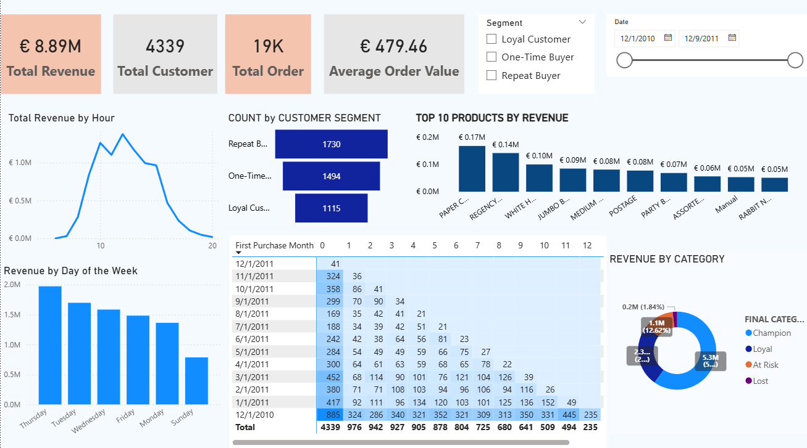

# HimanshiHotwani_Porfolio

# 📊 Himanshi Hotwani | Data Analytics & Business Intelligence Portfolio

Welcome to my data analysis portfolio! Here you will find end-to-end projects covering data cleaning, exploratory data analysis, interactive Excel dashboards, and SQL queries.

> 💡 **Important Note for Reviewers:**  
> Please **download the `.xlsx` files and open them directly in Microsoft Excel** for the best viewing experience! Opening these files in Google Sheets or web previews may distort dashboard formatting, pivot charts, and dynamic slicers.
> 

## 🚀 Featured Projects

* ### 1. 🛒 E-Commerce Conversion Optimization & Funnel Analytics
* **Tools Used:** Power BI | SQL | Advanced Excel | AI
* **Domain:** E-Commerce & Consumer Retail
* **Summary:** Analyzed customer drop-off across key purchase funnel stages—from landing page interactions to checkout completion. Identified critical friction points, modeled conversion leakages, and quantified revenue recovery strategies.

#### 📸 Executive Dashboard Preview:

#### 📁 Project Files & Artifacts:
* 📊 **Power BI Interactive Dashboard:** [`E-COMMERCE FUNNEL ANALYSIS PROJECT.pbix`](./E-COMMERCE%20FUNNEL%20ANALYSIS%20PROJECT.pbix)
* 📈 **Excel Dataset, view the Raw & Cleaned Data, Data Transformation, Industry-Real Questions with the probable solutions as per the DATA ANALYSIS (Google Drive):** [Download Full Dataset](https://docs.google.com/spreadsheets/d/1QxLpWhVRcvD_oB-Sr6zCSJuF_K_2Q3IH/edit?usp=drive_link&ouid=100385539789551355045&rtpof=true&sd=true)
* 📜 **SQL Data Transformation Script:** [`E-commerce Project_SQL.sql`](./E-commerce%20Project_SQL.sql)
* 📄 **Executive Project Summary:** [`E-Commerce Project_Summary.docx`](./E-Commerce%20Project_Summary.docx)
* 📑 **SQL Documentation & Analysis (PDF):** [`Himanshi_SQL__Ecommerce Project.pdf`](./Himanshi_SQL__Ecommerce%20Project.pdf)

---

### 2. 👥 HR Workforce Attrition & Employee Satisfaction Analytics
* **Tools Used:** MS Excel | Data Modeling | Pivot Analysis
* **Domain:** Human Resources & Operations
* **Summary:** Diagnosed workforce attrition patterns across 1,470 employee records to uncover core drivers behind turnover. Highlighted high overtime friction, burnout metrics, and retention risks among early-tenure hires.

#### 📁 Project Files & Artifacts:
* 📊 **HR Analytics Excel Dashboard:** [`HR DATA_Excel_Dashboard.xlsx`](./HR%20DATA_Excel_Dashboard.xlsx)

---

### 3. 🚲 Bike Sales Consumer Segmentation & Purchasing Behavior
* **Tools Used:** MS Excel | Pivot Tables | Customer Demographics
* **Domain:** Consumer Retail & Behavior Analysis
* **Summary:** Evaluated consumer demographic attributes including income levels, commute distances (0–1 miles), age groups, and car ownership to analyze purchase conversion triggers for bicycle sales.

#### 📁 Project Files & Artifacts:
* 📊 **Bike Sales Excel Dashboard:** [`Excel Project_Bike Sales Dashboard (1).xlsx`](./Excel%20Project_Bike%20Sales%20Dashboard%20(1).xlsx)

---

### 4. 🗃️ SQL Data Analytics & Data Cleaning Case Studies
* **Tools Used:** SQL (Joins, Aggregations, Window Functions, Subqueries) | Data Cleaning
* **Domain:** Database Querying & Exploratory Data Analysis (EDA)
* **Summary:** Applied structured SQL queries and data transformation techniques to resolve real-world database queries, clean raw analytical datasets, and deliver structured business insights.

#### 📁 Project Files & Artifacts:
* 📜 **Data Cleaning Portfolio:** [`Himanshi_DataCleaning_Portfolio.docx`](./Himanshi_DataCleaning_Portfolio.docx)
* 📜 **SQL Case Study Portfolio:** [`Himanshi_SQL_Portfolio-1.docx`](./Himanshi_SQL_Portfolio-1.docx)

---

## 🛠️ Technical Skill Set

| Category | Tools & Skill Sets |
| :--- | :--- |
| **Business Intelligence** | Power BI, Interactive Dashboards, DAX, Data Modeling |
| **Data Analysis & Excel** | Advanced MS Excel (Pivot Tables, Advanced Formulas, Power Query) |
| **Database Management** | SQL (Joins, Aggregations, Complex Functions, Data Cleaning) |
| **Analytical Methods** | Funnel Analysis, Attrition Diagnostics, Consumer Segmentation |

---

## 📬 Connect & Contact
* **GitHub Profile:** [HimanshiHotwani505](https://github.com/HimanshiHotwani505)
* **Linkedin Profile:** [HimanshiHotwani_Linkedin](https://www.linkedin.com/in/himanshihotwaniofficiall)
